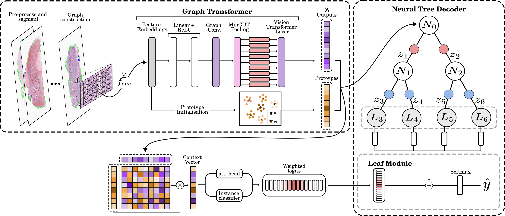
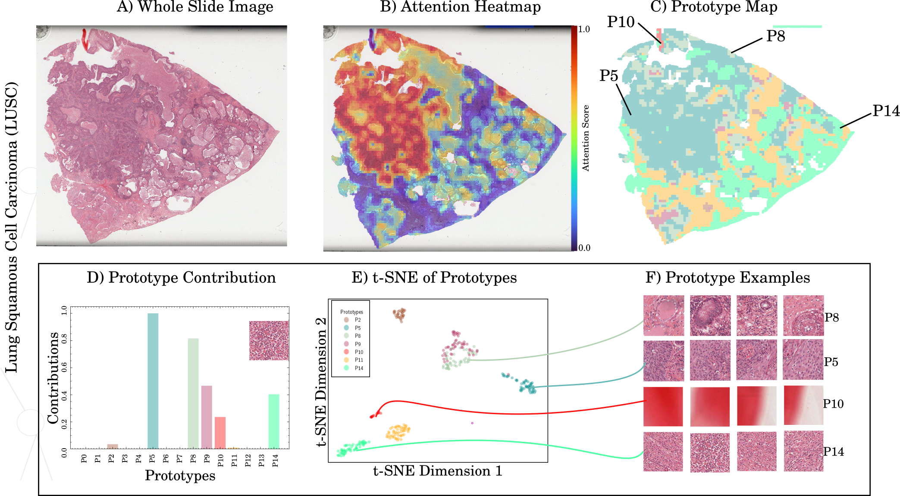

# **HistoTree**

**HistoTree** is a framework designed for handling and analyzing whole slide images (WSIs) in a hierarchical manner,  
 leveraging patch-based features and a tree-like structure for classification tasks.  
 This README outlines the dataset organization, patch feature extraction, training, and inference processes.




---
## **Installation**
After cloning the repository, run the following command to set up the HistoTree Conda environment:
```bash
conda env create -f env.yaml
```

## **Dataset Organization**
Ensure that the dataset is properly structured with CSV files containing the splits for training, validation, and testing.   
For example, for a classification task on the **TCGA-NSCLC** dataset, the folder structure should look like this:  

<pre>
lung_files/
├── train_0.txt
├── val_0.txt
└── test_0.txt
</pre>

## **Patch Features**
We assume that features for each patch have already been extracted and that each WSI is represented  
as a set of patch features. For examples of patch feature extraction, please refer to [CLAM](https://github.com/mahmoodlab/CLAM).


## **Feature Extraction**

To extract features from WSIs, use the following command:

```bash
python create_features.py \
    --dataset "patches_dir/*" \  # Directory containing patch-level images
    --slide_dir slide_dir \      # Directory containing WSI slides
    --output feat_dir            # Output directory for storing extracted features

```
## Train

To train the model, use the following command:

```bash
python parser.py \
    --dataset lung \            		# Dataset name (e.g., breast, lung, rcc)
    --n_class 2 \                 		# Number of classes in the dataset
    --config configs/tcga_lung.yml \  		# Configuration file path
    --task_name task_name \ # Task name
    --train \                    		# Flag to indicate training mode
    --train_set lung_files/train_0.txt \  	# Training set file
    --val_set lung_files/val_0.txt \      	# Validation set file
    --feature_path feat_dir \     		# Path to extracted features
    --ni \                        		# Flag for no user interaction (optional)
    --batch_size 8 \              		# Batch size for training
    --exp exp     \                   		# Experiment folder
    --task survival                     #for a survival task
```

## Inference

To test the model, use the following command:

```bash
python parser.py --feature_path feat_dir \                     # Directory containing feature files
    --dataset lung \                                           # Dataset name (e.g., breast, lung, rcc)
    --val_set "lung_files/test_0.txt" \                        # Path to the test set file
    --task_name "task_name" \                                    # Name of the task to execute
    --batch_size 1 \                                           # Batch size for testing
    --test \                                                   # Run the script in test mode                                         # Depth of the model/tree
    --config configs/tcga_lung.yml \                           # Path to the configuration file
    --ni \                                                     # Flag for no user interaction (optional)
    --vis_folder "test_folder" \                               # Directory for saving visualization outputs
    --task survival                     #for a survival task
```


## Saving the scores

This script saves attention scores to a specified folder (`--vis_folder`) for faster visualization.  
Instead of reloading the model each time, the scores are directly loaded from this folder.


```bash
python parser.py --feature_path feat_dir \
    --val_set "lung_files/test_0.txt" \
    --task_name "task_name" \
    --batch_size 1 \
    --explain \
    --config configs/tcga_lung.yml \
    --ni \
    --vis_folder "test_folder" \
    --n_class 2 \
    --task survival                  
```


## Visualization

To generate heatmaps, use the following command:  


  


```bash
python create_cat_heatmap.py \
    --config configs/heatmap_config_camelyon.yaml \  	# Path to the YAML configuration file for the heatmap generation
    --save_exp_code \                               	# Save experimental code for reproducibility
    --path_file <path_to_file> \                    	# Path to the file containing the images we want to generate attentiion and prototype maps for
    --path_WSI <path_to_WSI_directory> \            	# Path to the directory containing WSIs
    --path_graph <path_to_graph_data> \             	# Feat dir
    --vis_folder <path_to_output_visualizations>    	# Directory where scores are saved

```


